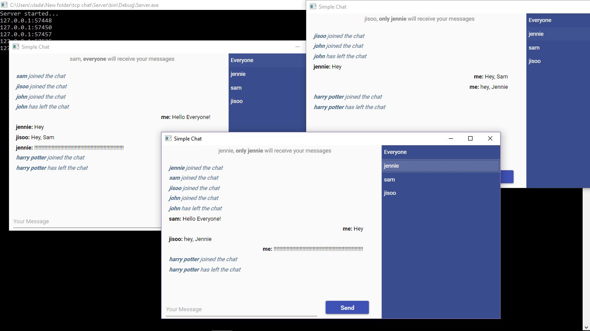

# TCPChat
Simple TCP/IP chat using WPF/MVVM

# Features

- unique username
- send your message to everyone in chat
- send your message to only one specific person

# How to Use:

**1** - Run the server (from folder "Server")

**2** - After server has been started you can run as many clients as you want (from folder "TCPChat")

# Screenshot:

